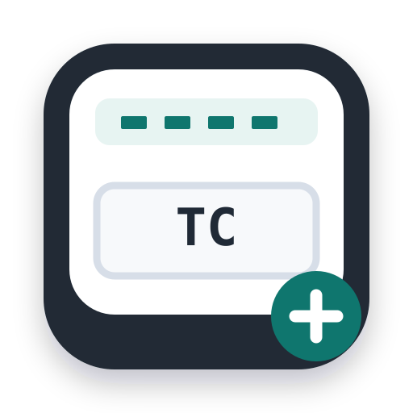

<div align="center">
  
  <h1>SlateSync</h1>
  <p><strong>把声音时码拉回正轨，让声画合板更清楚。</strong></p>
  <p>Local-first LTC decoding, BWF timecode repair, and workflow-ready Poly WAV export.</p>
  <p><a href="#单文件版">单文件即用</a> · <a href="#快速开始">快速开始</a> · <a href="#命令行导出">命令行导出</a> · <a href="#验证与兼容性">验证与兼容性</a> · <a href="#english">English</a> · <a href="LICENSE">MIT License</a></p>
</div>

---

**SlateSync** 是面向双系统录音、ZOOM H 系列分轨和后期声画同步的本地工具。它从音轨中读取 LTC，推算文件起始时间码，编辑 WAV/BWF 元数据，并把同一 take 的节目音轨打包为 Poly WAV。

浏览器版运行时使用原生 HTML/CSS/JavaScript，没有后端，也不需要安装任何依赖。只有可选的[单文件版](#单文件版)打包会在构建时用到 esbuild。文件解析、LTC 分析与导出都在本机完成；命令行导出也只处理本地文件。

> **单文件即用**
>
> 从 [Releases](https://github.com/NkAntony777/slatesync/releases) 下载 `bwf-timecode-singlefile-*.html`，**双击即可在浏览器中运行**：不需要安装 Python、不需要启动本地服务器、不需要 npm。写回时码、合并 Poly 等功能全部保留，素材全程不离开本机。
>
> 自行构建：`npm install && npm run build:single -- --repo https://github.com/NkAntony777/slatesync`，详见[单文件版](#单文件版)。
>
> **注意区分**：仓库根目录的 `index.html` 本身**不是**单文件程序。它依赖完整 `src/`、Service Worker 与图标，需要通过本地 HTTP 服务或 HTTPS 打开；单文件能力来自上面的构建产物。
>
> **重要素材先备份。**“合并 Poly”生成新文件，但直接写回时码会修改源 WAV；静音源 LTC 通道后，撤销按钮不能恢复音频内容。

## 功能

| 功能 | 说明 |
|---|---|
| LTC 解码 | 结合 16 位整数键与慢速 PLL 的鲁棒双相标记解调，吞吐量提升 2.3x~3.4x（长素材超 780x 实时）；支持录音机时钟温漂自适应补偿与增强识别 |
| 低电平恢复与诊断 | 只对分析副本增益，保留原始电平；成功提示复核，失败提供原因与建议；守卫 P0 绝对零误锁红线 |
| WAV/BWF 时间码 | 查看、偏移和写入 `bext.TimeReference` / iXML 时间戳，提供修改预览与元数据撤销 |
| Take 分组 | 按分轨文件名主干分组，适合 `ZOOM0001_Tr1.WAV`、`Tr2`、`LR` 等结构 |
| Poly WAV | 连续通道映射、iXML track list、离散多通道布局；可排除已确认的 LTC 技术轨 |
| 工作流导出 | Resolve、Sidus、PluralEyes、Syncaila、Archive 文件策略；可选 mono SyncRef 与中文合板说明 |
| 视频与元数据 | 读取支持的 MOV/MP4 时间码，导入/导出 CSV、ALE 元数据 |
| PWA | 安装与离线缓存机制；成功在线加载并缓存后可离线运行 |
| 单文件版 | 打包为一个自包含 HTML，双击即用、无需本地服务器；功能与网页版一致（不含 PWA 离线缓存） |

支持的 WAV 解析路径包括 RIFF、RF64、BW64、PCM、IEEE Float 和 WAVEFORMATEXTENSIBLE。具体素材能否处理仍取决于格式与信号质量，不代表所有设备、视频编码或大文件都经过实测。

## 快速开始

### 1. 获取项目

```bash
git clone https://github.com/NkAntony777/slatesync.git
cd slatesync
```

也可以使用 GitHub 的 **Code → Download ZIP**，解压后进入项目目录。

### 2. 启动本地服务

安装 Python 3 后，在项目根目录执行：

```bash
python -m http.server 8765 --bind 127.0.0.1
```

macOS/Linux 上，如果命令是 `python3`，请改用：

```bash
python3 -m http.server 8765 --bind 127.0.0.1
```

用 **Chrome 或 Edge** 打开：

```text
http://127.0.0.1:8765/
```

网页本身不需要安装 Node.js、FFmpeg 或 DaVinci Resolve。直接读写本地文件需要浏览器支持相应文件访问 API，并由用户授权。

### 3. 试用合成素材（可选）

安装 **Node.js 24+** 后：

```bash
node test/gen-demo.mjs demo
```

生成的 `demo/FOLDER01` 包含正常 LTC、延迟接入、无 LTC 和低电平 LTC 的演示 take。它们是合成测试信号，不是真实拍摄素材；生成文件不随源码仓库发布。

## 单文件版

`npm run build:single` 会把 `index.html`、34 个 ES 模块和整份 CSS 打包进**一个 HTML 文件**，双击即可运行，不需要本地 HTTP 服务。运行时零依赖，素材全程不离开本机。

```bash
npm install          # 仅构建需要 esbuild；打包产物本身无运行时依赖
npm run build:single -- --repo https://github.com/NkAntony777/slatesync
```

产物位于 `dist/bwf-timecode-singlefile-v1.5.0.html`。`dist/` 已在 `.gitignore` 中，构建产物不进入源码仓库，通过 GitHub Release 分发；`--repo` 参数用于在页脚写入来源仓库地址。

单文件版**保留完整功能**，包括写回时码和合并 Poly：`file://` 在 Chrome / Edge 属于 secure context，File System Access API（`showSaveFilePicker` / `showDirectoryPicker`）可用，因此不需要为降级功能改代码。

与 PWA 版的两点差异：

- **不提供 PWA 离线缓存。** Service Worker 必须以同源独立脚本注册，无法内联进单文件；应用对该场景已有降级分支。
- **输出方案仍只有 `resolve`。** 五种 Poly 方案的数据层与 CLI 均已就绪，但网页的选择控件尚未接入（见[命令行导出](#命令行导出)）。

构建脚本保留 `<script type="module">` 与 ESM 输出格式，因为应用入口存在顶层 `await`；LTC Worker 本就从模板字符串经 Blob URL 创建，不需要额外文件。`app-version.js` 读取版本号的 `fetch` 由内联 shim 应答，因此版本号仍与仓库的 `CACHE_NAME` 同源。

**验证范围（2026-10-06，Chromium on Windows，`file://` 打开）：**

| 检查项 | 结果 |
|---|---|
| 内联 module 启动、整页零外部请求 | 通过 |
| 版本号来自内联 shim | 通过（`v1.5.0`） |
| File System Access API 可用 | 通过（不降级） |
| 拖入演示素材、take 分组 | 通过 |
| Blob URL Worker 解码 LTC 并回填 | 通过（`01:23:45:19`） |
| 提取流程结束并报告结果 | 通过 |

复现：`npm run build:single -- --repo <仓库地址>` 后执行 `node test/verify-single-file.mjs`。

> **未覆盖**：真实点击触发的保存/写回操作（自动化只验证了 API 存在，未走完文件选择器）、Safari / Firefox、长时间漂移与真实拍摄素材。单文件版不改变任何解码或写入逻辑，但仍建议对重要素材先备份。

## 典型工作流

```text
FOLDER01/
  ZOOM0001_Tr1.WAV   节目音轨
  ZOOM0001_Tr2.WAV   节目音轨
  ZOOM0001_Tr6.WAV   已确认录入 LTC 的音轨
```

1. 把文件或文件夹拖入页面，检查 take 分组和素材参数。
2. 选择正确帧率，注意 **23.976 ≠ 24、29.97 ≠ 30**，以及 DF/NDF。
3. 点击 **从音轨提取时码**，查看成功结果与诊断报告。
4. 对低电平、低质量、帧率不符的结果进行人工交叉复核；无法锁定时不要把猜测当正确时码。
5. 点击 **合并 Poly WAV**，选择使用 LTC、预览或原始时间码。
6. 默认 Resolve 清洁方案在启用 LTC 清理时，会移除**已确认**的 LTC 通道，不留下静音空轨；源分轨不受合并操作影响。
7. 在目标剪辑软件中检查通道映射和同步，并核对开头、中段与结尾。

> 文件名 `Tr6` 不等于 LTC。必须由检测或用户确认通道来源。
> 静音、小电平、LR 混音和 ISO 都不能自动等同于“无用音轨”。

## 命令行导出

软件方案选择、显式音轨选择和 SyncRef 已有数据层/CLI 接口，**当前网页没有对应的完整选择控件**。需要这些功能时可使用命令行：

```bash
node scripts/export-sync-package.mjs --help
```

例如，读取低电平演示 take，只输出节目轨并生成独立 mono 参考文件：

```bash
node scripts/export-sync-package.mjs --input demo/FOLDER01 --output output/ZOOM0004 --take ZOOM0004 --profile resolve --auto-ltc --channels ZOOM0004_Tr1.WAV:1 --reference ZOOM0004_Tr1.WAV:1
```

| 方案 | 用途 | LTC 策略 | 输出编码 |
|---|---|---|---|
| `resolve` | 清洁节目 Poly | 排除已确认的 LTC 通道 | PCM24 |
| `sidus` | 继续保留技术轨以读取 LTC | 保留 | PCM24 |
| `pluraleyes` | 波形比较与参考声工作流 | 排除已确认的 LTC 通道 | PCM24 |
| `syncaila` | 波形/XML 工作流与参考声 | 排除已确认的 LTC 通道 | PCM24 |
| `archive` | 保留来源编码的归档副本 | 保留；网页旧静音选项可继续生效 | 来源编码 |

CLI 每次处理一个 take，读取输入文件夹第一层 WAV。通道参数使用 **1-based** 编号；输出目录必须在输入目录之外。默认不覆盖已有输出，自动 LTC 失败时默认拒绝输出。

导出可包含：

```text
ZOOM0004_resolve_Poly.WAV
ZOOM0004_resolve_SyncRef.WAV       可选，辅助参考，不是新增节目轨
ZOOM0004_resolve_合板说明.txt
ZOOM0004_resolve_channels.json
```

PCM24 方案不会重采样。Float 超过 0 dBFS 转定点可能削波，导出结果会报告削波/非有限样本；这类素材应先降低增益或使用 Archive 保留原始编码。

完整用法：[命令行交付指南](scripts/README-sync-package.md)。

## DaVinci Resolve 合板要点

- 在 **Clip Attributes → Audio** 检查节目通道；需要独立麦克风轨时按 Mono 离散映射。
- 本机实测中，4/5 通道默认导入为 Adaptive，双通道为 Stereo，**不会自动变成多条 Mono 轨**。
- 共同时码可信时使用 **Auto Sync Audio → Timecode**。
- 波形同步需要摄影机与录音机录到相同现场声音，comparison channel 不能是 LTC 或静音轨。
- **Retain embedded audio** 会额外保留摄影机原始音轨；不需要参考声时关闭，不能把这些轨误认为 Poly 多余通道。
- 不要同时把同一 take 的主 Poly、原始分轨和 SyncRef 当成不同录音合板；也不要无意叠加 LR mix 与全部 ISO。

详细说明：[中文声音合板指南](docs/声音合板指南.md)。

## 算法演进与架构

v1.5.0 全面融合了三条算法演进路线的成果（详见 [LTC 解码算法探索与融合沉淀](docs/LTC算法探索与融合沉淀.md)、[LTC 算法路线](docs/算法路线-LTC解码.md) 与 [LTC 前馈定时方案](docs/LTC前馈定时方案.md)）：
- **吞吐量与性能飞跃**：滚动 16-bit 整数键与通道切片计算提升（Hoisting），使单通道 LTC 解码吞吐量提升 2.3x~3.4x，长素材解码实现高达 780x 实时速度（`npm run bench`）。
- **鲁棒 PLL 边缘解调**：对数时序代价候选竞争与慢速锁相环，抗模拟削波与抖动畸变。
- **时钟温漂自适应补偿**：多窗口动态估算录音设备时钟漂移率（`driftRatio` / `driftPpm`），自动消除长音频文件的起始时码累积误差。
- **前馈定时解调原型**：通信理论 NDA ML 能量最大化准则，白噪声极限推至 -7.3 dB，对白极限 -23.7 dB，88 组极端压测 0 误锁。

## 验证与兼容性

2026-10-06 的全量验证记录：

| 范围 | 结果 | 能证明什么 |
|---|---|---|
| LTC 与 Poly 核心回归测试 | 28 项通过 | 低电平 LTC、负样本阻断（对白/正弦/噪声）、WAV 布局、PCM24、iXML 兼容 |
| 既有业务集成测试 | 26 项检查通过 | 合成信号、take 分组、诊断、Poly 输出等场景 |
| 主线程 / Worker 位对齐测试 | 42 组通过（100% 对齐） | 跨 30 组正样本 + 12 组负样本，主线程与 Worker 输出逐字段完全一致 |
| LTC 晶振温漂修正测试 | 4 项通过 | 2000 ppm 偏差长音频起始时间码误差从 2070 samples 纠正至 110 samples |
| LTC 性能延迟门禁测试 | 6 项通过 | 60s 素材全量解码耗时处于安全门限内，具备 2.0x~3.3x 性能余量 |
| 抗误锁极端基准测试 | 88 组压测通过 | 56 组对白干扰 + 32 组白噪干扰，WRONG = 0（绝对零误锁） |
| DaVinci Resolve 20.3.3.10 / Windows | 20 项检查通过 | 合成素材导入与时码/波形同步，通道、起始时码和偏移验证 |
| 浏览器与 PWA | Worker 解码、断网刷新通过 | 当前本地验证环境的脚本和缓存路径 |
| 单文件版（`file://`，Chromium on Windows） | 11 项检查通过 | 内联启动、零外部请求、版本 shim、File System Access、take 分组、Blob Worker 解码、流程结束 |
| Sidus / PluralEyes / Syncaila | **尚未软件端实测** | 仅提供文件策略和流程说明，不等于兼容认证 |

Resolve 的实测覆盖 4/2/5/1 通道输出、时码替换、保留摄影机原声、主 Poly 波形同步、Mono SyncRef 波形同步。

公开摘要：[Resolve 20.3.3 验证结果](docs/validation/resolve-20.3.3.json)。原始报告、测试视频和 WAV 可用 `scripts/resolve/` 中的脚本在本地重新生成，不包含在源码发布中。

**未覆盖**所有真实拍摄素材、所有设备、全部帧率、真实超 4 GB RF64，或另外三款软件的实际往返。自动增益不能恢复量化归零和信息完全淹没；固定时间码偏移也不能代替物理同步时钟。

## 分发与部署

| 方式 | 用户需要什么 | 当前状态 |
|---|---|---|
| 源码 ZIP / Git clone | 完整目录 + 本地 HTTP 服务 | 可用 |
| 静态网站 / GitHub Pages | 浏览器；初次加载需要网络 | 可部署，推送源码本身不等于已启用 Pages |
| PWA 离线使用 | 先成功加载并缓存应用 | 已有机制；浏览器缓存仍可能被清理 |
| 单个 HTML 双击运行 | 仅需该 HTML 文件，无需本地服务 | 可用；由 `npm run build:single` 生成，见[单文件版](#单文件版) |
| 双击即用桌面/便携包 | 本地服务启动器或桌面封装 | **尚未提供** |

静态部署需要至少保留 `index.html`、完整 `src/`、Service Worker、manifest 和图标，不能只上传 HTML。仓库包含 `.nojekyll`，可用于普通静态资源发布。

## 安全与隐私

- 默认应用流程没有音视频上传后端，媒体处理在本机进行。
- 在线部署只托管应用资源；浏览器授权与素材读写仍在用户机器上。请自行评估所使用的托管服务及浏览器环境。
- 直接写回 BWF 时码会修改源文件；先备份，再预览和确认。
- **撤销是元数据恢复，不是完整文件备份。静音源 LTC 音频不能通过撤销恢复。**
- 合并操作不修改源分轨，但网页批量输出可能覆盖目标目录中的同名文件；CLI 默认拒绝覆盖。
- SyncRef 是辅助比较声音，不能误当成新增制作轨叠加播放。

## 开发与测试

Node.js 24+；本次验证使用 Node.js 24.12.0。核心回归测试不需要安装 npm 依赖：

```bash
npm test                  # 核心回归测试（28 项底层 + 26 项业务）
npm run test:all          # 全量测试（含 42 组主线程/Worker对齐、漂移补偿、性能门禁）
npm run bench             # 多素材解码实时吞吐量基准
```

Resolve 软件端验证额外需要安装并运行 Resolve、配置可用的 Python 脚本接口，视频样本生成需要 FFmpeg。详见 [Resolve 验证说明](scripts/resolve/README.md)。这些不是网页使用的前提。

单文件版的构建与校验需要额外一步（校验脚本还需要本机安装 Playwright 与 Chrome/Edge）：

```bash
npm install
npm run build:single -- --repo https://github.com/NkAntony777/slatesync
npm run verify:single
```

```text
index.html                         网页入口与控制器组装
src/
  timecode.js                      BigInt / 分数时间码计算
  ltc-decoder.js / ltc-worker.js   LTC 分析与 Worker
  ltc-robust.js                    鲁棒 PLL 边缘解调器
  ltc-feedforward.js               前馈定时解调器与带通滤波
  ltc-signal.js                    LTC_TUNING 参数中心与失败分类
  ltc-diagnostics.js               诊断与建议
  wave*.js                         WAV/BWF 解析与写入
  poly-export-profiles.js          输出方案与通道策略
  sync-workflow.js                 中文交付说明和通道清单
scripts/
  export-sync-package.mjs          本地命令行导出
  build-single-file.mjs            单文件 HTML 构建（需要 esbuild）
  resolve/                         Resolve 合成素材与 API 验证
test/
  bench-ltc.mjs                    LTC 解码吞吐量评估
  ltc-drift.test.mjs               晶振温漂修正测试
  ltc-parity.test.mjs              主线程与 Worker 位对齐测试
  ltc-performance.test.mjs         解码性能上限门禁
docs/                              合板指南、算法路线、方案沉淀、验证摘要
```

问题反馈请附上帧率/DF 设置、录音设备、格式/位深/通道数、诊断信息和复现步骤。涉及原始素材时，优先提供经授权的最小复现样本；不要公开私密录音。

## 致谢与许可

SlateSync 基于 [xnpeter / Audio TC Change](https://github.com/xnpeter/Audio-TC-Change) 二次开发，保留上游 **MIT License** 与原始版权声明。感谢上游提供的 WAV/BWF 时间码、LTC、视频元数据与本地工作流基础。

本项目继续以 [MIT License](LICENSE) 发布。DaVinci Resolve、Sidus、PluralEyes、Syncaila 等名称属于各自权利人；提及工作流不表示厂商背书或认证。

## English

**SlateSync** is a local-first toolkit for LTC decoding, WAV/BWF timecode repair, split-track grouping, and Poly WAV delivery. It includes signal diagnostics, analysis-only low-level gain, explicit channel selection, optional mono sync references, and readable workflow sidecars.

- **Run as a single file:** download `bwf-timecode-singlefile-*.html` from Releases and double-click it. No Python, no local server, no npm. All features (timecode write-back, Poly export) are preserved, because `file://` is a secure context in Chrome/Edge. Build it yourself with `npm run build:single`.
- **Run the web app:** clone the complete repository, run `python -m http.server 8765 --bind 127.0.0.1`, then open `http://127.0.0.1:8765/` in Chrome or Edge. The repository's `index.html` is **not** a standalone distributable — use the single-file build when you need one self-contained HTML file.
- **Use export presets:** `node scripts/export-sync-package.mjs --help`. Advanced preset/channel controls are available through the CLI/data API, not yet as complete web UI controls.
- **Validated:** synthetic-fixture import and timecode/waveform sync in DaVinci Resolve 20.3.3.10 on Windows. This is not certification for all footage or other applications.
- **Protect your originals:** in-place metadata writes modify source WAVs; muting source LTC audio cannot be undone by the metadata undo button.
- **License:** MIT, derived from Audio TC Change with upstream attribution preserved.
